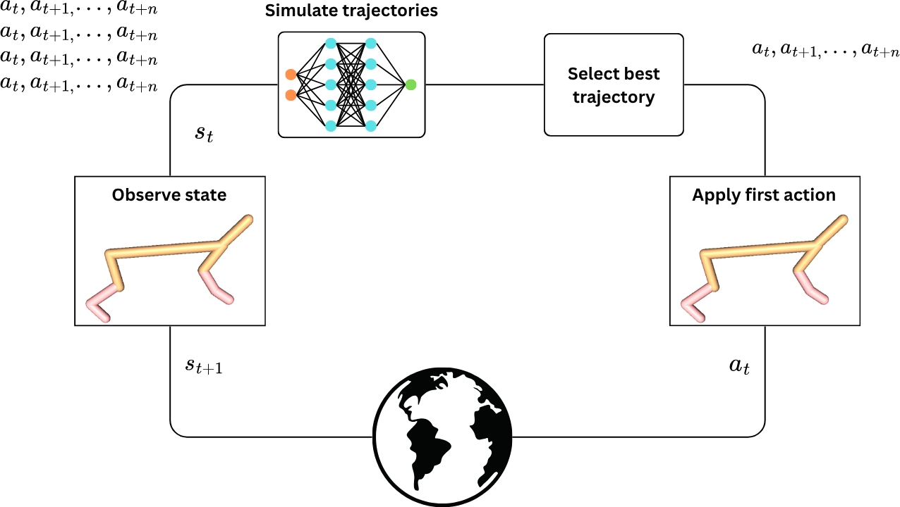
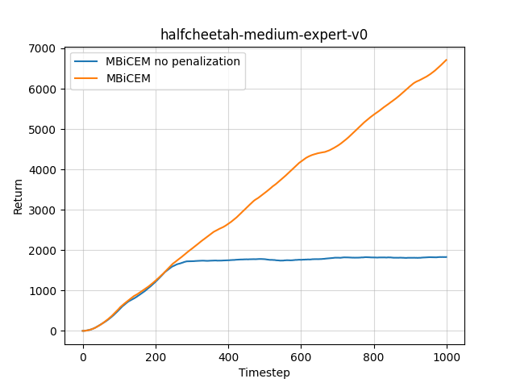

# MBiCEM: Model-based trajectory planner based on iCEM

This repository contains the implementation of my MSc thesis work on model-based trajectory planning and reinforcement learning.
The project explores applying trajectory planning using learned models of the environment dynamics. The main algorithm tested is [iCEM](https://martius-lab.github.io/iCEM/). The models are represented as an ensemble of neural networks, the implementation of these ensembles can be found [here](https://github.com/AndrewKM210/dynamics-ensembles-rl). To deal with the uncertainty about the accuracy of the model, predictions that lead to high ensemble disagreement are heavily penalized. The use of value functions and a behavior cloned policy to improve performance is explored.

<!--  -->
<p align="center">
  
</p>


# Project Overview

The goal is to implement a model-based trajectory planner that avoids model uncertainty.

- Re-implements iCEM
- Adapts iCEM to work with learned dynamics models (MBiCEM)
- Explores the use of value functions ensembles
- Compares to behavior cloning

Repository Structure
```bash
.
├── behavior_cloning # for learning policies with behavior cloning
│   ├── bc_policy.py
│   └── learn_bc_policy.py
├── configs # configuration files
│   ├── ...
├── environments # environment wrappers
│   ├── fake_env.py
│   └── gym_env.py
├── reward_functions # reward and termination functions for the different environments
│   ├── ...
├── value_functions # for learning an ensemble of value functions (Q() or V())
│   ├── learn_q_fn.py
│   ├── learn_v_fn.py
│   ├── q_fn.py
│   └── v_fn.py
├── .gitignore
├── agent.py # agent wrapper
├── icem_utils.py # additional utils
├── icem.py # main iCEM algorithm, adapted to work with learned models
├── main.py # prepares experiment
└── mbop.py # MBOP algorithm extended to work with learned models
```

# Installation

The project was tested with Python 3.10.18. It is recommended to use ```pyenv``` to create a new virtualenv.

```bash
git clone https://github.com/AndrewKM210/MBiCEM.git
cd MBiCEM
pip install -r requirements.txt

```

# Usage

The configuration files contain the tuned parameters for the HalfCheetah, Hopper and Walker2d MuJoCo gym environments. To simply reproduce iCEM without learned models, the configurations ending in ```_gt``` should be sufficient:
```bash
python main.py --config configs/halfcheetah_gt.yaml --n_episodes 1
```

A progress bar appears when executing the script for only 1 episode with the current reward and return. If more than one episode, the script display de current mean return after each episode. Log are saved to ```logs``` by default, but can be changed with ```--log_dir```. To use learned models, first it is necessary to traing them following the process described [here](https://github.com/AndrewKM210/dynamics-ensembles-rl). It is also necessary to include the dataset, given that the prediction penalization threshold is computed by predicting on the dataset:
```bash
python main.py --config configs/halfcheetah.yaml --dataset datasets/halfcheetah_medium.pkl --model trained_models/halfcheetah.pkl 
```

Other algorithms can be used instead of iCEM. For example, [MBOP](https://arxiv.org/abs/2008.05556):
```bash
python main.py --config configs/halfcheetah.yaml --dataset datasets/halfcheetah_medium.pkl --model trained_models/halfcheetah.pkl --alg alg_mbop
```

Behaviour cloning can be used by loading a policy trained following these [steps](behavior_cloning/README.md):
```bash
python main.py --config configs/halfcheetah_bc.yaml --bc_policy behavior_cloning/halfcheetah.pkl
```

Ensembles of value functions can be trained following these [steps](value_functions/README.md). Then, they can be used inside the algorithm:
```bash
python main.py --config configs/halfcheetah_bc.yaml --dataset datasets/halfcheetah_medium.pkl --model trained_models/halfcheetah.pkl --q_fn value_functions/halcheetah_qfn.pkl
```

# Example Results

The ```visualize.ipynb``` notebook contains the code necessary for plotting the return or cumulative reward from the logs. This example shows how penalizing predictions that contain high ensemble disagreement lead to better returns.



# TODO

- More visualization
- Track with MLflow

# References

- Pinneri et al. iCEM: Sample-efficient Cross-Entropy Method for Real-time Planning. CoRL 2020.
- Argenson et al. MBOP: Model-Based Offline Planning. NeurIPS 2020:
- Kidambi et al. MOReL: Model-Based Offline Reinforcement Learning. NeurIPS 2020.
